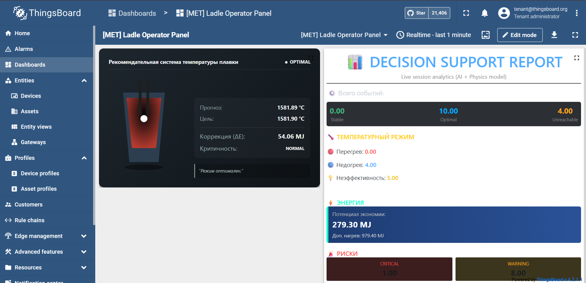
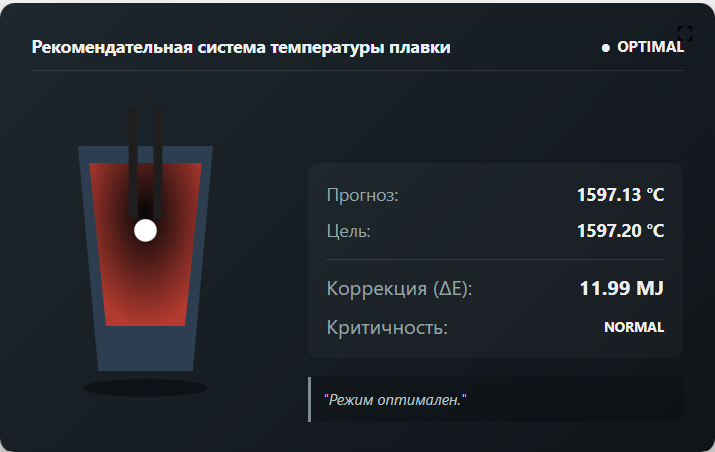
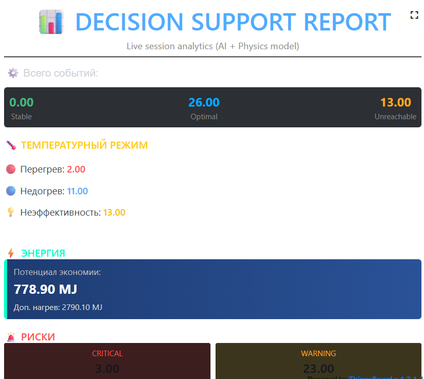
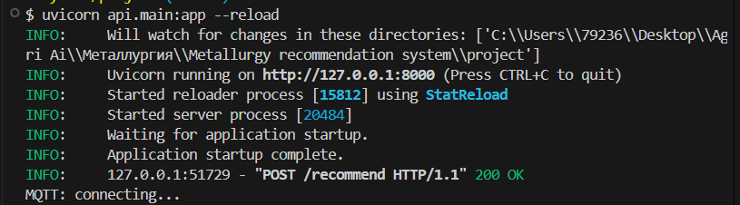
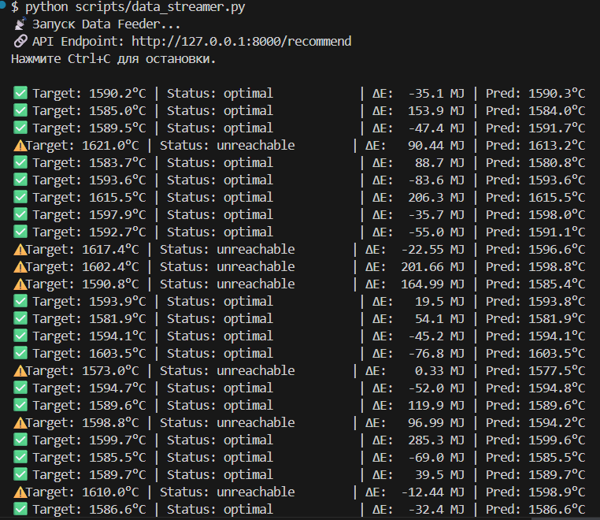

AI-система поддержки принятия решений для ковшевой печи

##  Настройка переменных окружения
Перед запуском проекта необходимо создать файл `.env` в корневой папке. 
В репозитории уже есть шаблон `.env.example` — просто скопируйте его, переименуйте в `.env` и укажите ваш реальный токен устройства ThingsBoard:
```env
DEVICE_TOKEN=your_thingsboard_device_token_here

Режимы запуска
Система может работать в двух режимах:
1. Базовый режим (Standalone)
Используется для быстрой проверки работы ML-модели и API без настройки внешних систем.
Что происходит:
запускается API (FastAPI)
модель выполняет предсказания
data_streamer имитирует поток данных
результаты выводятся в консоль
Запуск:
# 1. Установка зависимостей
pip install -r requirements.txt

# 2. Запуск API
uvicorn api.main:app --reload

В отдельном терминале:
python scripts/data_streamer.py
(Не требует настройки IoT-платформы)


2. Расширенный режим (IoT + Digital Twin)
Используется для визуализации работы системы через ThingsBoard.
Что происходит:
данные проходят через API
результаты отправляются по MQTT
отображаются на дашборде
Настройка ThingsBoard:
В репозитории доступны готовые конфигурации:
thingsboard/device.json
thingsboard/dashboard.json
Шаги:
Развернуть ThingsBoard (например, через Docker)
Импортировать device.json и dashboard.json
Получить Access Token устройства
Указать токен в файле `.env`
Запустить базовый режим
( IoT-режим является опциональным)


Описание проекта
Металлургическое производство требует точного контроля температуры расплава, так как именно она напрямую влияет на качество стали и энергозатраты.
В ковшевой печи (~100 тонн) сталь нагревается графитовыми электродами. В процессе обработки выполняются:
нагрев дугой
легирование (сыпучие и проволочные добавки)
продувка инертным газом
перемешивание и повторные замеры температуры
Каждая партия проходит несколько итераций обработки до достижения целевой температуры.
Задача
Необходимо предсказать финальную температуру расплава на основе технологических параметров процесса.
Задача формулируется как регрессия:
вход: параметры процесса (энергия, время, добавки, газ и др.)
выход: итоговая температура
Решение
В проекте реализована система поддержки принятия решений, которая:
прогнозирует финальную температуру (CatBoost)
моделирует поведение процесса
рассчитывает корректировку энергии (ΔE)
учитывает физические ограничения
Модель используется как основа для имитации технологического режима и формирования рекомендаций оператору.

Исследовательская часть (EDA & ML Modeling)
Основой для бэкенда цифрового двойника послужил детальный анализ исторических данных металлургического процесса
(полный пайплайн доступен в notebooks/metallurgy.ipynb).
Вместо прямого использования сырых данных был применён подход
physics-informed feature engineering (учёт физики процесса).
Очистка данных (физическая валидация)
Удалены физически невозможные состояния (температура < 1400°C)
Отфильтрованы аномалии датчиков (отрицательная реактивная мощность, некорректные измерения)
Обеспечена строгая хронология событий для предотвращения утечки данных
все признаки рассчитываются строго до финального измерения температуры
Feature Engineering
Энергетические признаки:
total_arc_energy — суммарная введённая энергия
активная и реактивная мощность
energy_rate — скорость нагрева (энергия/время)
Влияние материалов:
материалы сгруппированы по термодинамическому эффекту
созданы агрегированные признаки:
bulk_heat_markers
agg_coolants
Теплопотери:
process_duration используется как прокси-переменная для оценки естественного остывания
Выбор модели и валидация
Модель: CatBoost Regressor
устойчив к выбросам
эффективен для табличных промышленных данных
Качество модели
MAE (кросс-валидация): ~5.95°C
MAE (тест): ~6.03°C
Целевое требование (MAE ≤ 6.8°C) — выполнено
Сравнение с бейзлайном
DummyRegressor: ~8.2°C
Улучшение: ~26%
Модель демонстрирует стабильное качество (минимальный разрыв между CV и тестом).

Трансформация процесса (As-Is vs To-Be)
As-Is (Традиционный подход)
Температура контролируется постфактум
Решения принимаются на основе опыта оператора
Недогрев приводит к дополнительным циклам нагрева
Перегрев → перерасход энергии
Анализ отклонений выполняется после завершения процесса
To-Be (ML + система поддержки решений)
Модель прогнозирует финальную температуру заранее
Система рассчитывает необходимую корректировку энергии (ΔE)
Учитываются физические ограничения (мощность печи)
Возможна симуляция технологического режима
Результаты доступны в реальном времени (API / IoT)
Ключевое изменение
От реактивного управления
→ к прогнозному и управляемому режиму


Демо
Основной дашборд (Digital Twin)



Пример рекомендации



Отчёт.



Взаимодействие с API



Симуляция данных в реальном времени



Пример сценария
Начальное состояние:
Температура = 1580°C (недогрев)
Система:
Рекомендует +3 МДж
Результат:
Прогноз = 1591°C (в целевом диапазоне)

Данные и feature engineering (инженерная логика)
Датасет отражает реальные этапы металлургического процесса:
циклы дугового нагрева
добавление сплавов (bulk, wire)
подача газа
последовательные измерения температуры
Ключевые этапы обработки:
Очистка данных (физическая валидация):
удаление температур < 1400°C
удаление отрицательной реактивной мощности
исправление некорректных временных меток
Контроль причинности:
все признаки вычисляются строго до финальной температуры
подтверждено отсутствие утечки данных
Feature engineering (с учетом физики процесса):
total_arc_energy — суммарная энергия
heating_rate — энергия в секунду
process_duration — прокси теплопотерь
bulk_heat_markers / agg_coolants — агрегированные эффекты материалов
Модель аппроксимирует тепловой баланс процесса, а не просто статистические зависимости.

Рекомендательная система (прескриптивная логика)
В отличие от обычных ML-моделей, система включает слой рекомендаций.
Цель:
Найти параметры нагрева (энергия, время), обеспечивающие целевую температуру.
Метод оптимизации:
Перебор (grid search) по:
Энергия (E): 20–80 МДж
Время (t): 1000–4000 сек
Физическое ограничение:
Мощность = E / t
5 МВт ≤ P ≤ 25 МВт
Рассматриваются только допустимые решения.
Целевая функция:
Жесткое ограничение:
температура должна быть в пределах ±2°C
Если выполнено:
минимизировать энергию и время
Если нет:
выбрать максимально близкую температуру
Выходные данные:

{
  "status": "optimal | suboptimal",
  "recommended_energy": E,
  "recommended_duration": t,
  "predicted_temp": value
}


Архитектура
Данные → Feature Engineering → ML-модель → Рекомендательная система → API → MQTT → Дашборд
Ключевые возможности
предсказание температуры с помощью ML
рекомендательная система с ограничениями
учет физики процесса
pipeline без утечки данных
интеграция с IoT


Пример запроса

{
  "target_temp": 1590,
  "features": {
    "first_temp": 1520,
    "total_arc_energy": 30,
    "total_heating_duration": 2000,
    "Wire 1": 10,
    "gas_volume": 5,
    "process_duration": 3000,
    "energy_rate": 1.2,
    "bulk_heat_markers": 2,
    "agg_coolants": 400,
    "mean_apparent_power": 15,
    "mean_power_factor": 0.85
  }
}

Интеграция с MQTT
Система публикует результаты через MQTT:
topic: metallurgy/prediction
Сообщение содержит:
предсказанную температуру
целевую температуру
delta_energy
status
Опционально: ThingsBoard
Можно импортировать готовые дашборды:
thingsboard/dashboard.json
Ограничения
нет замкнутого контура обратной связи
упрощенные физические ограничения
офлайн-модель
основано на исторических данных
Примечания
Проект демонстрирует:
end-to-end ML систему
обработку промышленных данных
логику поддержки принятия решений
интеграцию с IoT

О проекте и данных.
Исходный датасет и базовая исследовательская часть (EDA) были подготовлены в рамках выпускной квалификационной работы на курсе Data Science от Яндекс Практикум. 
В данном репозитории оригинальное исследование расширено: офлайн-модель трансформирована в  прототип индустриального цифрового двойника с потоковой передачей данных, оптимизатором ограничений и IoT-визуализацией.
